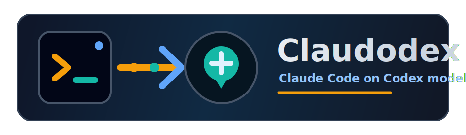

<p align="center">
  
</p>

<p align="center">
  <strong>Claude Code, routed through your OpenAI Codex subscription.</strong>
</p>

<p align="center">
  <a href="LICENSE"></a>
  
  
</p>

Claudodex is a focused launcher and compatibility proxy for running the real
`claude` binary against OpenAI Codex subscription models. It is not a
multi-provider proxy, not a Codex CLI wrapper, and not a replacement terminal
UI. You still use Claude Code. Claudodex swaps the model backend.

```text
you -> claudodex -> installed claude -> local Anthropic-compatible proxy -> Codex
```

## Why Claudodex?

There are already useful projects in this space, including Claudish,
ccproxy-api, claude-code-proxy variants, and Codex proxy experiments. Many of
them try to support a long list of providers, models, transports, and runtime
styles. That flexibility is valuable, but it can also make the Claude Code plus
Codex subscription path harder to install, harder to reason about, or easier to
miss in small compatibility details.

Claudodex deliberately takes the opposite shape: one launcher, one target use
case, and as little setup as possible. The goal is that a person with a Codex
subscription and an installed `claude` binary can log in once, run `claudodex`,
and get a Claude Code experience whose backend is Codex.

Why not call it `claudex`? Because that name is already used in multiple places.
`Claudodex` is clunkier, but it is specific and searchable.

## What It Does

- Runs your installed `claude` binary with normal Claude Code flags.
- Authenticates to OpenAI through `claudodex clx:auth-login`.
- Maps Claude model families to Codex models:
  - Opus -> `gpt-5.6-sol`
  - Sonnet -> `gpt-5.6-terra`
  - Haiku -> `gpt-5.6-luna`
- Maps Claude Code `max` effort to Codex `max` for GPT-5.6. Claude Code's
  `ultracode` mode enables its workflow orchestration while still sending
  Codex `max` effort; older models fall back to their highest supported level.
- Disables Claude Code's deferred tool-search protocol so complete tool
  definitions are sent through the Codex-compatible request path.
- Fetches live Codex model metadata for context windows, model capabilities, and
  auto-compact limits.
- Keeps Claude Code settings shared with normal Claude Code while keeping
  Claudodex auth isolated.
- Sets Claude privacy flags by default:
  `CLAUDE_CODE_DISABLE_NONESSENTIAL_TRAFFIC=1`, `DISABLE_TELEMETRY=1`,
  `DO_NOT_TRACK=1`, and `DISABLE_GROWTHBOOK=1`.
- Provides Codex-backed usage through `claudodex clx:usage`.

## Current Status

Claudodex is experimental. The core request path, streaming conversion, OAuth,
usage mapping, settings sync, model metadata, and installed-Claude smoke tests
are implemented. The project intentionally stays narrow: Claude Code to Codex
subscription models only.

The polished Claude Code UI branding patch is currently gated to known Claude
Code binaries by OS, architecture, version, and SHA. Unsupported Claude Code
versions still launch, but without UI patching. The rest of the compatibility
layer is designed to keep working when Claude Code updates.

## Requirements

- Go 1.25 or newer (matching `go.mod`).
- A working `claude` binary on `PATH`.
- An OpenAI account with Codex subscription access.
- macOS arm64 for the current verified UI patch. Other platforms may run
  unpatched, but are not the main tested path yet.

## Install From Source

Build Claudodex first, then copy the resulting binary somewhere on your `PATH`.
The `go build` step is the build; the install step only copies the binary.

```sh
git clone https://github.com/bassner/claudodex.git
cd claudodex
go build -o claudodex ./cmd/claudodex
mkdir -p ~/.local/bin
install -m 0755 claudodex ~/.local/bin/claudodex
```

If `~/.local/bin` is not on your `PATH`, either add it or choose another
user-writable directory that is. To install system-wide on macOS, use `sudo`:

```sh
sudo install -m 0755 claudodex /usr/local/bin/claudodex
```

Alternatively, let Go build and install the command into your Go binary
directory:

```sh
go install ./cmd/claudodex
```

Verify both binaries are callable:

```sh
claude --version
claudodex clx:version
```

## Getting Started

1. Log in to OpenAI:

   ```sh
   claudodex clx:auth-login
   ```

2. Check the local setup:

   ```sh
   claudodex clx:doctor
   ```

3. Start Claude Code through Claudodex:

   ```sh
   claudodex
   ```

4. Or run a one-shot prompt:

   ```sh
   claudodex -p "Reply with exactly: ok"
   ```

All normal Claude Code arguments are passed through:

```sh
claudodex --model opus
claudodex --model sonnet --dangerously-skip-permissions
claudodex --continue
```

## Commands

```sh
claudodex clx:auth-login
claudodex clx:auth-status
claudodex clx:auth-logout
claudodex clx:doctor
claudodex clx:usage
claudodex clx:reset-installation-id
claudodex clx:serve --host 127.0.0.1 --port 0
claudodex [normal claude args...]
```

`claudodex --help` and `claudodex --version` intentionally execute `claude`
directly. Use `claudodex clx:version` for the Claudodex version.

## Model Overrides

Default model targets are centralized and can be changed at startup:

```sh
claudodex --claudodex-opus-model gpt-opus-next
claudodex --claudodex-sonnet-model gpt-sonnet-next --model sonnet
claudodex --claudodex-haiku-model gpt-haiku-next
claudodex --claudodex-models opus=gpt-opus-next,sonnet=gpt-sonnet-next,haiku=gpt-haiku-next
```

Overrides affect routing, model argument rewriting, `/v1/models`, capability
cache, statusline context, auto-compact limits, effort handling, and settings
normalization. The selected Codex models must appear in live Codex model
metadata with context-window information.

## Settings And Privacy

Claudodex uses a Claude Code compatibility sidecar under `~/.claudodex`, but
normal Claude Code settings remain the source of truth where possible:

- `~/.claude/` files such as settings, agents, plugins, MCP config, and project
  state are symlinked into the sidecar.
- `~/.claude.json` is mirrored instead of symlinked because it also contains
  account and API-key state.
- Non-auth settings are reconciled before launch, while Claude is running, and
  during shutdown.
- Fake Claude OAuth state for the local compatibility layer stays isolated in
  Claudodex's sidecar.

Claudodex also restores the user's original proxy and shell environment for
Claude Code tool subprocesses, so Bash commands do not inherit Claudodex's
internal API proxy.

## Diagnostics

```sh
claudodex clx:doctor
claudodex clx:usage
```

`clx:doctor` checks whether `claude` is installed, whether Claudodex auth is
present, and whether Codex usage is reachable. `clx:usage` prints Codex-backed
usage windows directly.

Claude Code's built-in `/usage` command is still subject to Claude Code's own
essential-traffic privacy gate. Claudodex keeps that privacy flag enabled, so
`clx:usage` is the reliable usage command for now.

## Development

```sh
gofmt -w $(find . -path ./other_repos -prune -o -name '*.go' -print)
go test -count=1 ./...
go vet ./...
go build -o ./claudodex ./cmd/claudodex
```

Optional installed-Claude smoke test:

```sh
CLAUDODEX_RUN_INSTALLED_CLAUDE_SMOKE=1 \
  go test -count=1 ./internal/launcher \
  -run TestInstalledClaudePrintSmokeWithFakeCodexUpstream -v
```

Live checks require a completed `clx:auth-login`:

```sh
./claudodex -p "Reply with exactly: ok"
./claudodex clx:usage
```

## Contributing

Contributions are welcome, especially compatibility fixes for new Claude Code
versions and Codex response shapes. Please read [CONTRIBUTING.md](CONTRIBUTING.md)
before opening a pull request.

## License

MIT. See [LICENSE](LICENSE).
